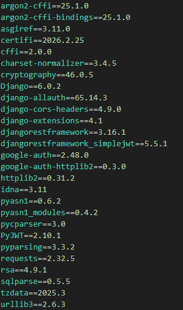
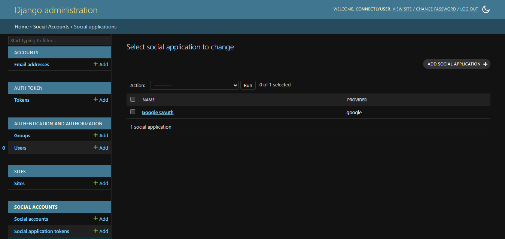
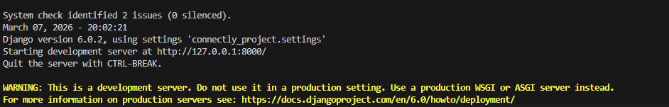
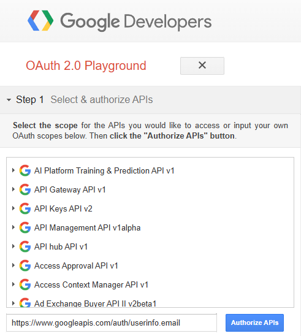
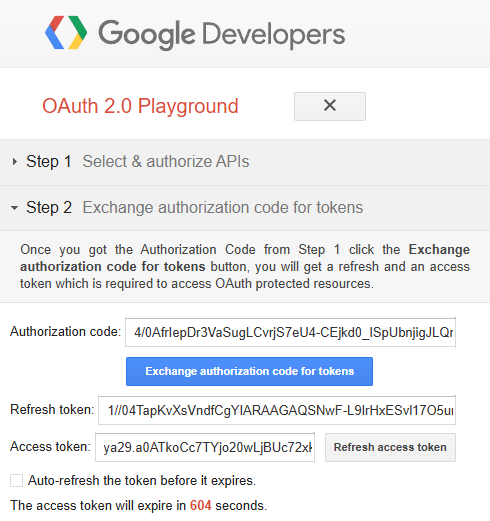
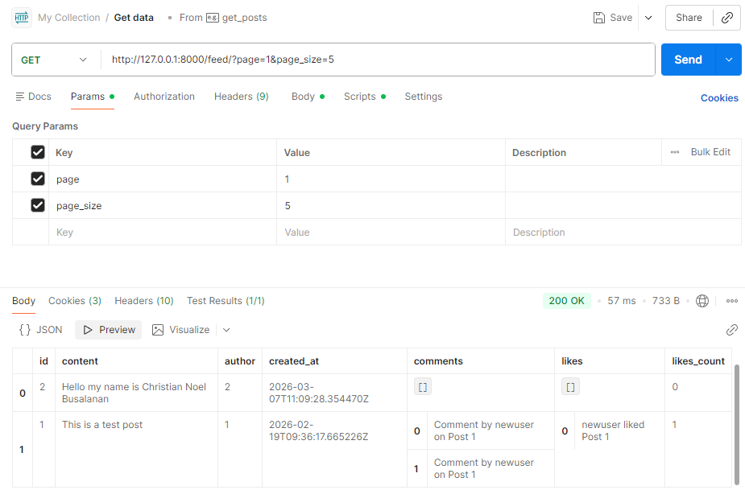
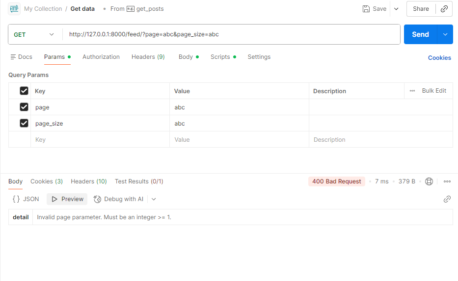

# Connectly API

A Django REST API for a simple social feed with Google OAuth login and JWT authentication.

---

## ✅ Quick Start (Setup)

### 1) Clone and activate your virtual environment

```bash
cd connectly_project
python -m venv env
# Windows PowerShell
.\env\Scripts\Activate.ps1
```

> 📌 If the repo already contains `env/`, just activate it.

---

### 2) Install dependencies

```bash
pip install -r requirements.txt
```




---

### 3) Run migrations

```bash
python manage.py migrate
```

---

### 4) Create a superuser

```bash
python manage.py createsuperuser
```

---

## 🔧 Configure Google OAuth (Required for `/auth/google/login/`)

### Option A (recommended): Use Django Admin

1. Run the server:

```bash
python manage.py runserver
```

2. Go to: `http://127.0.0.1:8000/admin/`
3. Log in with the superuser.
4. Under **Social applications**, add a new entry:
   - Provider: **Google**
   - Name: (anything, e.g. `Connectly Google`)
   - Client id: **your Google OAuth client ID**
   - Secret key: **your Google OAuth client secret**
   - Sites: select the site entry (usually `example.com` or `localhost`)




### Option B: Environment variables (auto-create)

Set these before running the server:

```powershell
$env:GOOGLE_CLIENT_ID="<your-client-id>"
$env:GOOGLE_CLIENT_SECRET="<your-client-secret>"
```

---

## ▶️ Running the Server

```bash
python manage.py runserver
```

Visit:
- API root (if available)
- Admin: `http://127.0.0.1:8000/admin/`



---

## 🧪 Testing the API

### 1) Get a JWT (Standard username/password)

**Request:**

```bash
curl -X POST http://127.0.0.1:8000/api/token/ \
  -H "Content-Type: application/json" \
  -d '{"username":"<your-username>","password":"<your-password>"}'
```

**Expected response:**

```json
{
  "access": "<jwt-access-token>",
  "refresh": "<jwt-refresh-token>"
}
```

---

### 2) Get a JWT via Google OAuth

This endpoint expects a **Google OAuth access token** (or an `id_token`), which you acquire by signing in with Google via a real OAuth flow.

#### 2.1) Get a Google access token (using OAuth Playground)

1. Open the OAuth 2.0 Playground: **https://developers.google.com/oauthplayground**
2. In **Step 1**, search for and select these scopes:
   - `https://www.googleapis.com/auth/userinfo.email`
3. Click **Authorize APIs** and sign in with a Google account.
4. Click **Exchange authorization code for tokens**.
5. Copy the `access_token` from the response.




#### 2.2) Call the API with the Google token

```bash
curl -X POST http://127.0.0.1:8000/auth/google/login/ \
  -H "Content-Type: application/json" \
  -d '{"access_token": "<google-access-token>"}'
```

> ✅ Or (if you used `id_token`):
>
> ```bash
> curl -X POST http://127.0.0.1:8000/auth/google/login/ \
>   -H "Content-Type: application/json" \
>   -d '{"id_token": "<google-id-token>"}'
> ```

**Expected response:**

```json
{
  "access": "<jwt-access-token>",
  "refresh": "<jwt-refresh-token>"
}
```

> 📌 **Image placeholder:** Screenshot of Postman request/response for Google login.

---

## 📰 News Feed Endpoint (GET /feed/)

### ✅ Basic paginated request

```bash
curl "http://127.0.0.1:8000/feed/?page=1&page_size=5"
```

### ✅ Example response

```json
{
  "page": 1,
  "page_size": 5,
  "total": 12,
  "results": [
    {"id": 12, "content": "...", "created_at": "2026-03-07T.."},
    ...
  ]
}
```



### ✅ Filtering by user

```bash
curl "http://127.0.0.1:8000/feed/?user=alice&page=1&page_size=5"
```

### ✅ Error handling (invalid params)

```bash
curl "http://127.0.0.1:8000/feed/?page=abc&page_size=5"
```

**Response:**

```json
{
  "detail": "Invalid page parameter. Must be an integer >= 1."
}
```



---

## 🔐 Using the JWT for protected actions

### Create a post (requires JWT)

```bash
curl -X POST http://127.0.0.1:8000/api/posts/ \
  -H "Content-Type: application/json" \
  -H "Authorization: Bearer <jwt-access-token>" \
  -d '{"content":"Hello from Postman"}'
```

---

## ✅ Notes / Tips

- If your JWT expires, refresh it:

```bash
curl -X POST http://127.0.0.1:8000/api/token/refresh/ \
  -H "Content-Type: application/json" \
  -d '{"refresh":"<jwt-refresh-token>"}'
```
